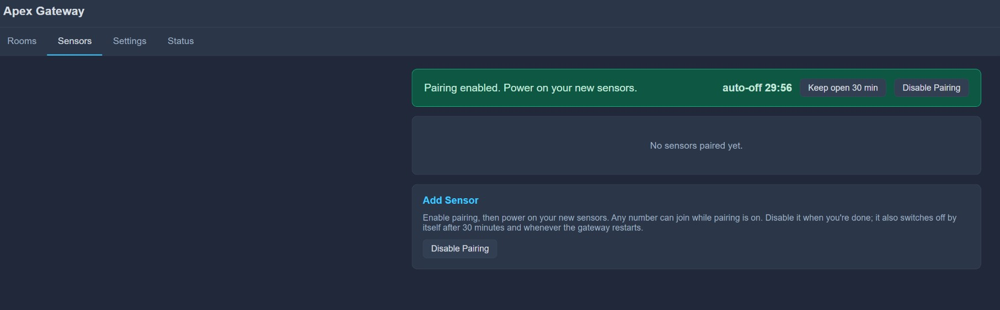
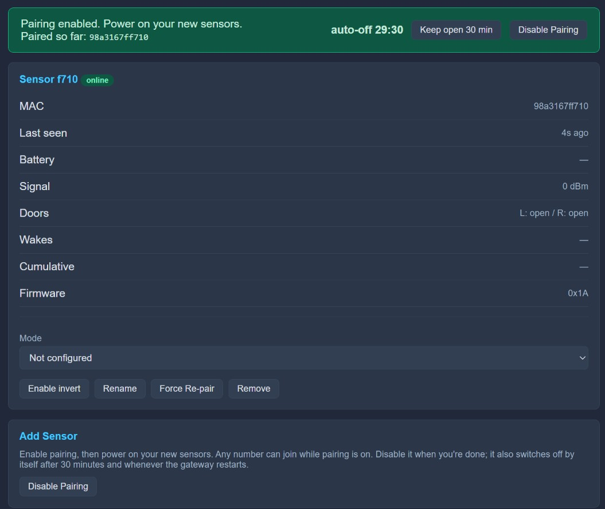

# Step 2: Pairing & Configuration

Before you mount the sensor, you need to link it to your Gateway. Keep the sensor near you for this step, since you'll power it on while the Gateway is waiting for it.

---

## 1. Linking to the Gateway
To add a new sensor, you first turn on pairing on the Gateway. While pairing is on, the Gateway accepts new sensors, so you can add one sensor or several in one go.

1.  **Open Dashboard:** Navigate to `http://apex.local` on your browser. Go to the Sensors tab.

    

2.  **Enable Pairing:** In the **Add Sensor** card, click **Enable Pairing**. A banner appears saying **Pairing enabled. Power on your new sensors.**

    

    !!! info "No need to rush"
        Pairing stays on until you turn it off. As a safety measure it also switches off by itself after 30 minutes, shown as **auto-off** on the banner. Click **Keep open 30 min** if you need more time.

3.  **Activate the Sensor:** While pairing is on, power on your Crosswalk sensor. It will automatically start up and pair with the Gateway.

    === "Battery-Powered"

        The battery is already inside the case, but it isn't plugged in. To connect it:

        1.  Slide the back cover of the case **partway** open. You only need enough room to reach the battery plug, so don't take it all the way off.
        2.  Plug the battery's small white connector into the matching socket on the board.
        3.  Slide the back cover closed again.

        

        !!! info "Watch the dashboard, not the sensor"
            Once it's running on battery, the sensor keeps all of its lights off to save power — so there is no light to tell you it is awake and working. The Gateway dashboard is where you confirm pairing.

    === "Hardwired"

        Plug a USB-C cable into the sensor and into a USB power adapter.

        !!! info "Watch the dashboard, not the sensor"
            The red power light and the green light come on as soon as the sensor has power. They only mean the board is powered, not that it has paired. The Gateway dashboard is where you confirm pairing.

    - **Note:** The sensor will scan for the Gateway automatically.

4.  **Success:** When the sensor pairs, its code appears on the banner under **Paired so far**, and a new card for it appears in the sensor list.

    

5.  **Disable Pairing:** If you have more sensors to add, power them on now. They'll pair the same way. When you're done, click **Disable Pairing**.

    !!! info "Why turn pairing off?"
        While pairing is on, any Crosswalk sensor in range can join your Gateway. Turning it off when you're finished keeps your setup to just your own sensors. Pairing also turns off whenever the Gateway restarts.

6. **Home Assistant:** Check out your new sensor in Home Assistant!

    

    The Apex Crosswalk Gateway should now show a connected sensor as well.

    

    Check out a Room.

    

    Now go look at the sensor.

    

---

## 2. Device Settings
Now you can customize how this sensor behaves in your home. Go back to the Apex Gateway web page.

1.  **Find Your Sensor:** On the **Sensors** tab, find your new sensor in the list. A new sensor is named **Sensor** followed by a four-character code, such as `Sensor e574`, and shows an **online** badge.

2.  **Rename It:** On that sensor's card, click the **Rename** button below the Mode menu. Give it a clear name like "Office Door" or "Office - Bathroom Door", then confirm.

    

!!! info "Leave the Mode as 'Not configured' for now"
    You'll choose the counting mode in the next step, once the sensor is mounted on the doorway. Until then it won't count anyone.

---

-   [:octicons-arrow-right-24: **Next Step: Mounting (Step 3)**](./sensor-install.md)

