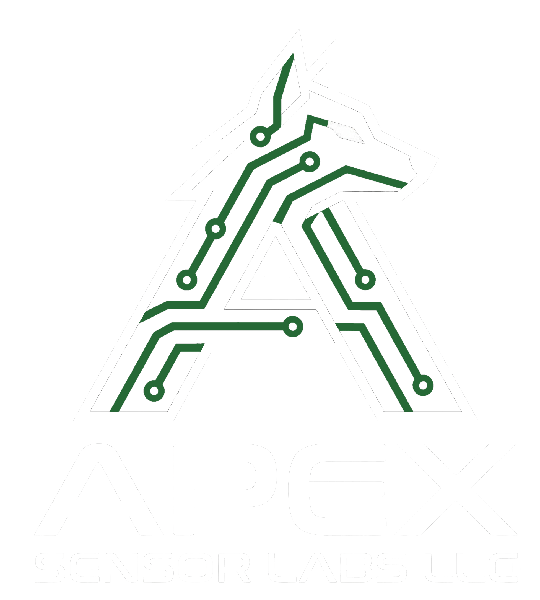

---
hide:
  - navigation
  - toc
---

  

# Apex Sensor Labs { align=center }

## Local-First. Privacy-Focused. { align=center }

---

### Coming Soon
**Apex Core** and the full suite of local-first sensors are currently in final development. We are building the infrastructure for a smart home that respects your privacy and works entirely without the cloud.

Matter™ and Zigbee® are trademarks of the Connectivity Standards Alliance.  
© 2026 Apex Sensor Labs LLC.

